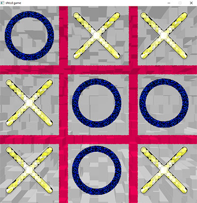

# tic-tac-toe

[The Cherno OpenGL series](https://www.youtube.com/playlist?list=PLlrATfBNZ98foTJPJ_Ev03o2oq3-GGOS2)

## Build

### Windows MSYS2

    pacman -S mingw-w64-x86_64-glfw mingw-w64-x86_64-glew mingw-w64-x86_64-glm
    wget https://raw.githubusercontent.com/nothings/stb/master/stb_image.h
    cd build
    cmake ../ -G"Unix Makefiles"
    cmake --build . --parallel

### Ubuntu Linux

    sudo apt-get install libglfw3 libglfw3-dev libglm-dev libglew-dev
    wget https://raw.githubusercontent.com/nothings/stb/master/stb_image.h
    cd build
    cmake ../
    cmake --build . --parallel
